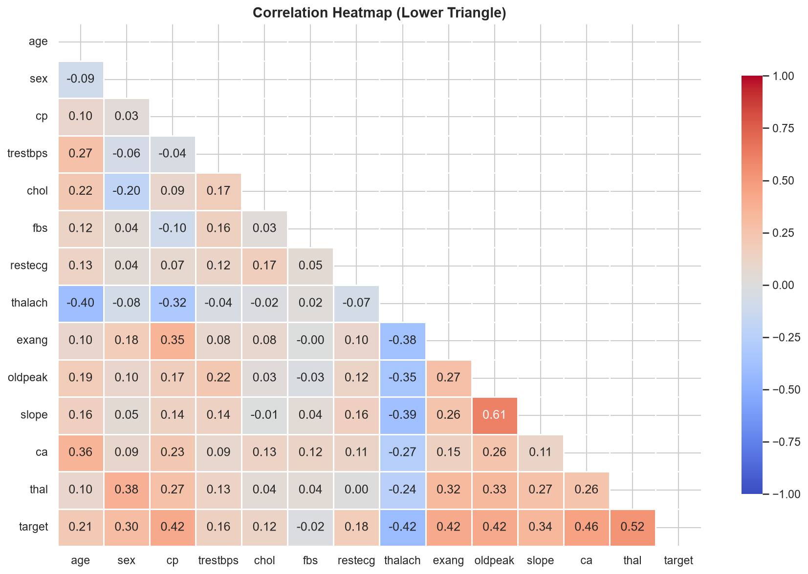
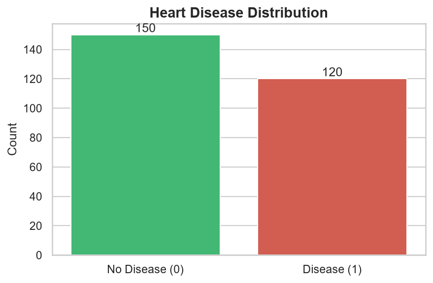
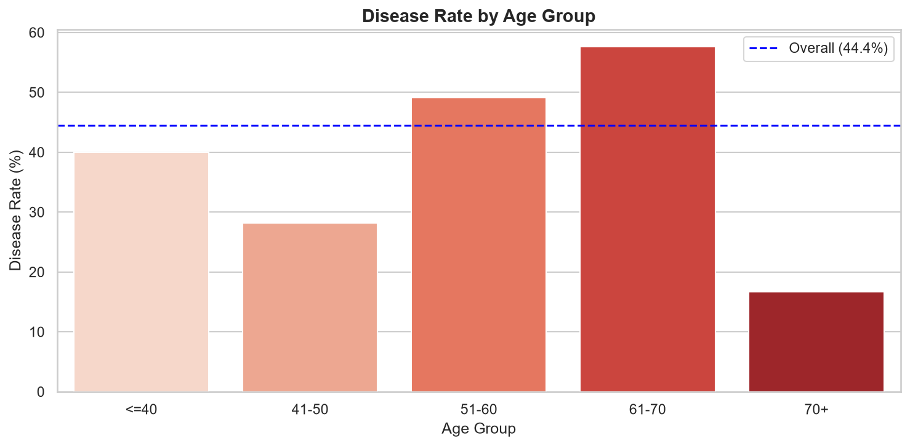
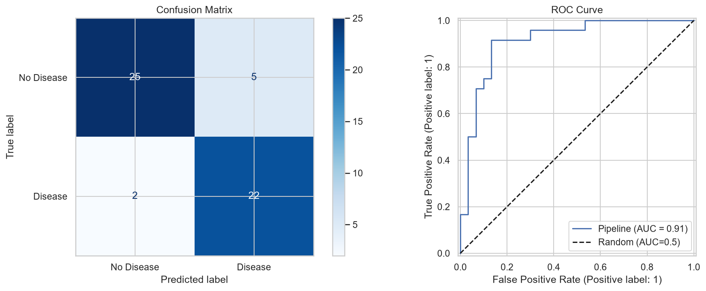
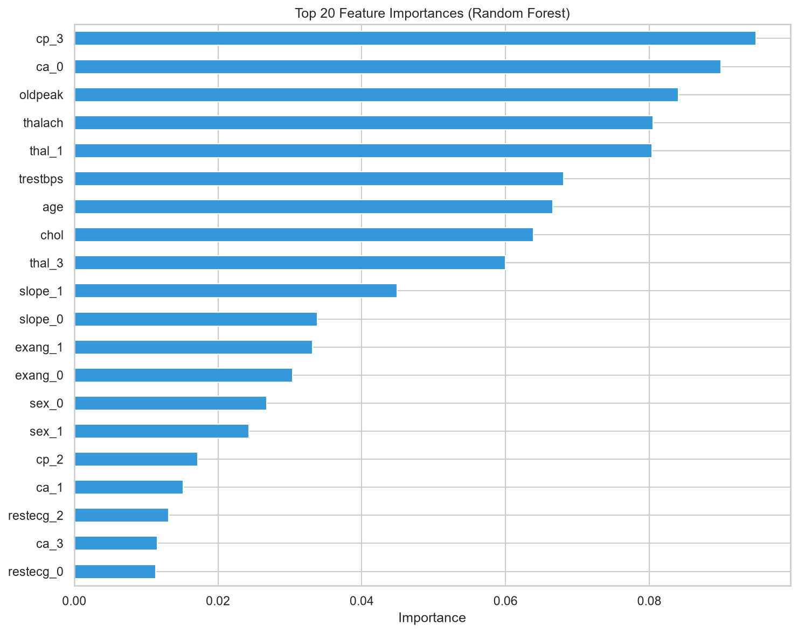
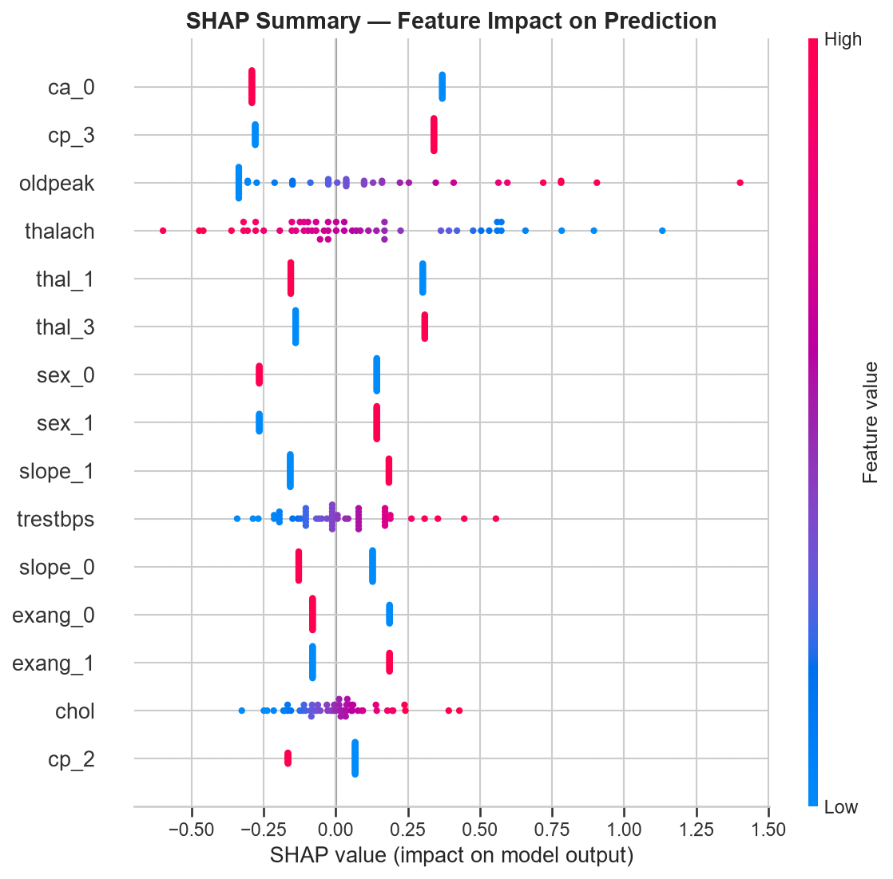
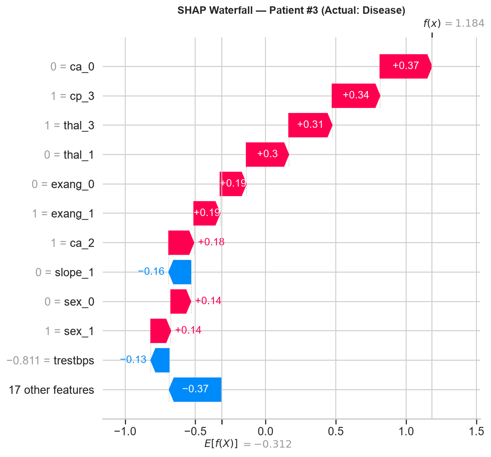

# 🫀 Heart Disease Prediction & Analysis

An end-to-end data science project analyzing the UCI Heart Disease Statlog dataset — from exploratory data analysis to an interpretable machine learning model with SHAP explainability.


---

## 📌 Project Overview

Heart disease is one of the leading causes of death worldwide. Early detection can save lives. This project aims to:

- **Analyze** patient data to identify key risk factors
- **Build** a machine learning model to predict heart disease
- **Explain** the model's decisions using SHAP
- **Provide** an interactive web app for predictions

**Dataset:** [UCI Heart Disease Statlog](https://archive.ics.uci.edu/ml/datasets/Statlog+%28Heart%29) — 270 patients, 13 clinical features, 1 binary target.

---

## 🎯 Key Results

| Metric | Value |
|--------|-------|
| **Best Model** | Logistic Regression (tuned) |
| **Test ROC-AUC** | **0.925** |
| **Test Accuracy** | **87.04%** |
| **Test F1-Score** | **0.8627** |
| **Cross-Validation ROC-AUC (5-fold)** | 0.9119 |

### Model Comparison

| Model | ROC-AUC | Accuracy | F1 |
|-------|---------|----------|-----|
| **Logistic Regression** ⭐ | **0.9097** | **0.8284** | **0.7982** |
| SVM (RBF) | 0.9033 | 0.8195 | 0.7905 |
| Random Forest | 0.9010 | 0.8145 | 0.7884 |
| KNN (k=7) | 0.8801 | 0.8148 | 0.7769 |
| Gradient Boosting | 0.8800 | 0.8006 | 0.7816 |

> 💡 **Insight:** Simple logistic regression outperformed complex ensemble models, a common finding on small clinical datasets.

---

## 📊 Key Findings (EDA)

### Disease group differences

| Feature | No Disease | Disease | Interpretation |
|---------|-----------|---------|----------------|
| Age | 52.7 | 56.6 | Older patients more at risk |
| Resting BP | 128.9 | 134.4 | Higher BP → higher risk |
| Cholesterol | 244.2 | 256.5 | Higher chol → higher risk |
| **Max Heart Rate** | **158.3** | **138.9** | ⬇️ Lower max HR → higher risk |
| **Oldpeak** | **0.62** | **1.58** | ⬆️ Higher ST depression → higher risk |

### Top predictive features (SHAP)

1. **`ca`** — number of major vessels (0 = protective)
2. **`cp_3`** — chest pain type 3 (asymptomatic, high risk)
3. **`oldpeak`** — ST depression induced by exercise
4. **`thalach`** — maximum heart rate achieved
5. **`thal`** — thalassemia type

---

## 📁 Project Structure

```
heart-disease-portfolio/
├── data/
│   ├── raw/
│   │   └── Heart_disease_statlog.csv
│   └── processed/
│       └── heart_clean.csv
├── notebooks/
│   ├── 01_data_understanding.ipynb
│   ├── 02_eda.ipynb
│   ├── 03_modeling.ipynb
│   └── 04_explainability.ipynb
├── reports/
│   ├── figures/                      # 20+ saved plots
│   ├── model_comparison.csv
│   ├── final_metrics.csv
│   ├── feature_importance.csv
│   ├── shap_importance.csv
│   ├── permutation_importance.csv
│   └── eda_summary_by_target.csv
├── models/
│   └── heart_disease_model.pkl
├── app.py                            # Streamlit web app
└── README.md
```

---

## 🛠️ Tech Stack

- **Data:** pandas, numpy
- **Visualization:** matplotlib, seaborn
- **ML:** scikit-learn (Logistic Regression, Random Forest, SVM, KNN, Gradient Boosting)
- **Explainability:** SHAP
- **Stats:** scipy, statsmodels
- **App:** Streamlit
- **Environment:** Python 3.14, Jupyter / VS Code

---

## 🚀 How to Run

### 1. Clone the repo

```bash
git clone https://github.com/Bilaldataorbit/heart-disease-portfolio.git
cd heart-disease-portfolio
```

### 2. Install dependencies

```bash
pip install pandas numpy matplotlib seaborn scikit-learn shap joblib jupyter streamlit
```

### 3. Run the notebooks

Open the `notebooks/` folder in VS Code or Jupyter and run them in order:

1. `01_data_understanding.ipynb` — Load, clean, and inspect data
2. `02_eda.ipynb` — Exploratory analysis + trends + peaks
3. `03_modeling.ipynb` — Train 5 models, tune, evaluate
4. `04_explainability.ipynb` — SHAP analysis

### 4. Run the web app

```bash
streamlit run app.py
```

---

## 🔬 Methodology

### 1. Data Understanding
- 270 rows × 14 columns
- **0 missing values**, **0 duplicates**
- Target: 55.6% no disease, 44.4% disease (balanced)

### 2. EDA
- Univariate distributions + boxplots
- Correlation heatmap
- Age-binned trend analysis
- Peak detection on histograms and KDE
- Statistical tests: t-test, Mann-Whitney U, Chi-square

### 3. Modeling
- **Preprocessing:** StandardScaler for numeric, OneHotEncoder for categorical
- **Pipeline:** ColumnTransformer + classifier
- **Splitting:** 80/20 stratified split
- **CV:** Stratified 5-fold
- **Tuning:** GridSearchCV on `C`, `penalty`, `solver`

### 4. Explainability
- SHAP beeswarm + bar plots (global)
- SHAP dependence plots (feature interactions)
- SHAP waterfall (local predictions)
- Permutation importance (model-agnostic)

---

## 📈 Visualizations

### Correlation Heatmap


### Target Distribution


### Disease Rate by Age


### ROC Curve & Confusion Matrix


### Feature Importance


### SHAP Summary


### SHAP Waterfall (Disease Patient)


> See `reports/figures/` for all 20+ plots.

---

## 💡 Business / Clinical Insights

1. **Max heart rate (`thalach`)** is one of the strongest negative predictors — patients who can't reach high HR during stress tests are at higher risk.
2. **ST depression (`oldpeak`)** from exercise is a strong positive predictor.
3. **Chest pain type 3** (asymptomatic) shows the highest disease rate — a counterintuitive but well-documented finding.
4. **Number of major vessels (`ca`)** is one of the top SHAP features.
5. A simple **Logistic Regression** model is sufficient — no need for deep learning on this dataset size.

---

## 🔮 Future Work

- [ ] Deploy app to Streamlit Cloud / Hugging Face Spaces
- [ ] Try XGBoost / LightGBM with cross-validation
- [ ] Add patient-level counterfactual explanations
- [ ] Bayesian hyperparameter optimization

---

## 👤 Author

**Bilal Raza**

- GitHub: [Bilaldataorbit](https://github.com/Bilaldataorbit)
- LinkedIn: [Your Profile](https://linkedin.com/in/your-profile)

> ⚠️ Update the GitHub and LinkedIn links once accounts are created.

---

## 📜 License

This project is licensed under the MIT License.

## 🙏 Acknowledgments

- UCI Machine Learning Repository for the dataset
- SHAP library by Scott Lundberg
- scikit-learn community